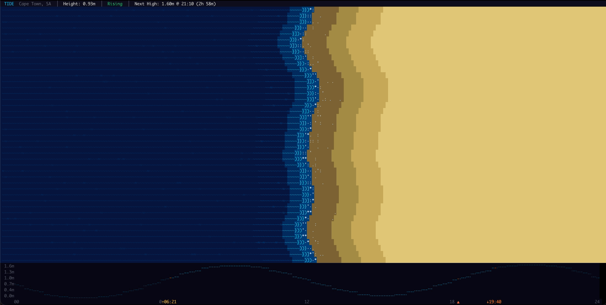

# tyde

A live ASCII ocean tide visualizer for your terminal. Real tidal physics, 25 worldwide stations, day/night cycle — no API keys, runs almost entirely offline.



## What it does

- Animated ASCII beach scene with waves, foam, and sand that respond to the real tide level
- Braille-dot tide chart showing the full 24-hour curve with current position marker
- Sunrise and sunset times marked on the chart in gold/orange
- Day/night lighting cycle — golden hour warmth at sunset, dark blue tint at night
- Auto-detects your location and picks the nearest of 25 coastal stations
- All predictions computed locally with harmonic tidal analysis — no tide data APIs

## Install

### macOS (Apple Silicon)
```bash
sudo curl -sSL https://github.com/moose-code/tyde/releases/latest/download/tyde-macos-aarch64 -o /usr/local/bin/tyde && sudo chmod +x /usr/local/bin/tyde
```

### macOS (Intel)
```bash
sudo curl -sSL https://github.com/moose-code/tyde/releases/latest/download/tyde-macos-x86_64 -o /usr/local/bin/tyde && sudo chmod +x /usr/local/bin/tyde
```

### Linux (x86_64)
```bash
sudo curl -sSL https://github.com/moose-code/tyde/releases/latest/download/tyde-linux-x86_64 -o /usr/local/bin/tyde && sudo chmod +x /usr/local/bin/tyde
```

### Linux (ARM64)
```bash
sudo curl -sSL https://github.com/moose-code/tyde/releases/latest/download/tyde-linux-aarch64 -o /usr/local/bin/tyde && sudo chmod +x /usr/local/bin/tyde
```

### From source
```bash
cargo install tyde
```

## Usage

```bash
tyde                           # auto-detect location, show nearest station
tyde --station "tokyo"         # pick a station by name (partial match)
tyde --list-stations           # print all 25 stations
tyde --offline                 # skip geolocation, use default (Cape Town)
```

Press `q` or `Esc` to quit.

## Stations

25 coastal stations covering all major coastlines:

| Region | Stations |
|--------|----------|
| North America | New York, Boston, Miami, San Francisco, Los Angeles, Seattle, Honolulu, Vancouver, Halifax |
| Europe | London, Lisbon, Amsterdam, Reykjavik |
| Asia | Tokyo, Shanghai, Mumbai, Singapore, Hong Kong, Dubai |
| Oceania | Sydney, Auckland |
| South America | Buenos Aires, Rio de Janeiro, Valparaiso |
| Africa | Cape Town |

## How it works

### No APIs. Just math.

The only network call tyde makes is a single HTTP request to `ip-api.com` on startup to guess your location (3-second timeout, no API key). If it fails — offline, VPN, firewall, anything — it silently falls back to a default station. Use `--station` or `--offline` to skip it entirely.

Everything else is computed locally with pure mathematics. The tide predictions, sunrise/sunset times, day/night cycle, and the full station database are all baked into the binary. No data downloads, no subscriptions, no keys, no updates needed.

### Tidal harmonic analysis

Tyde uses the same mathematical technique used by NOAA, the UK Hydrographic Office, and every major maritime authority in the world: **harmonic constituent analysis**.

The core equation:

```
h(t) = Z0 + Σ Aᵢ · cos(ωᵢ · t − φᵢ)
```

Each station's tide is modeled as the sum of 5 cosine waves, each driven by a different gravitational force:

| Constituent | Speed (°/hr) | Period | What drives it |
|-------------|-------------|--------|----------------|
| **M2** | 28.984 | 12h 25m | Moon's gravity (the big one — this is why you get ~2 high tides per day, and why they shift ~50 min later each day as the Moon advances) |
| **S2** | 30.000 | 12h 00m | Sun's gravity. When aligned with M2 → spring tides (new/full moon). When opposed → neap tides. |
| **N2** | 28.440 | 12h 39m | Moon's elliptical orbit — closer Moon pulls harder |
| **K1** | 15.041 | 23h 56m | Combined lunar-solar declination (once-daily component) |
| **O1** | 13.943 | 25h 49m | Moon's once-daily pull |

The speeds are **universal astronomical constants** — the same everywhere on Earth because they're set by celestial mechanics. What varies per station is:

- **Amplitude (Aᵢ)** — how strongly each constituent affects that location, in metres
- **Phase (φᵢ)** — when each wave peaks, encoding local geography: harbour shape, continental shelf depth, ocean basin resonance
- **Z0** — mean sea level above chart datum

These values are published by national hydrographic offices and are stable over decades.

### Solar position model

The day/night cycle and sunrise/sunset times use a proper solar altitude calculation:

- **Solar declination** from the Earth's 23.44° axial tilt and day of year
- **Solar altitude** via the standard spherical astronomy formula
- **Equation of Time** correction for Earth's elliptical orbit (±15 min through the year)
- **Longitude correction** for the station's position within its timezone (e.g. Cape Town at 18.4°E in UTC+2 centered on 30°E → solar noon at ~12:46 clock time)

### Haversine distance

Station selection uses great-circle distance to find the nearest station to your geolocated coordinates.

## Requirements

- A terminal with 24-bit color support (iTerm2, Alacritty, Kitty, WezTerm, modern GNOME Terminal, Windows Terminal)
- Minimum 40×10 terminal size (bigger is better)

## License

MIT
